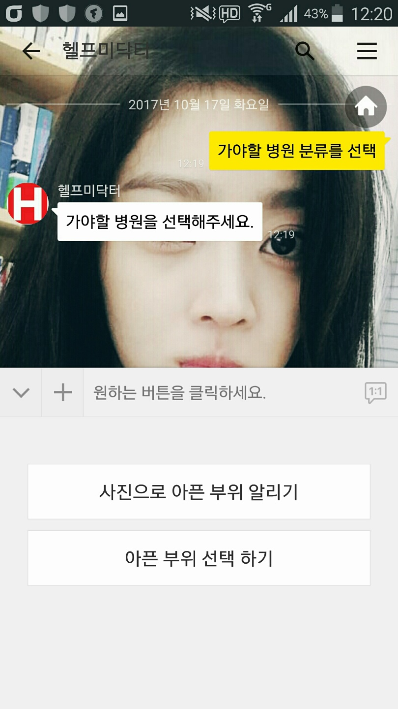
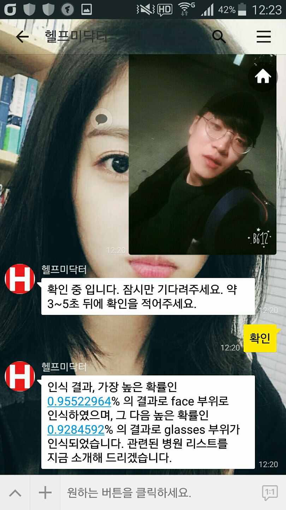
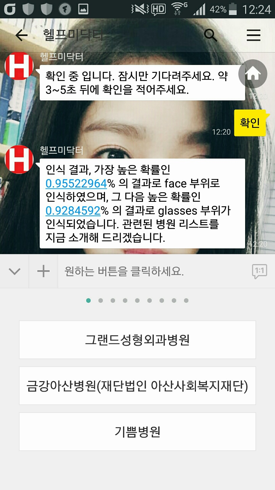
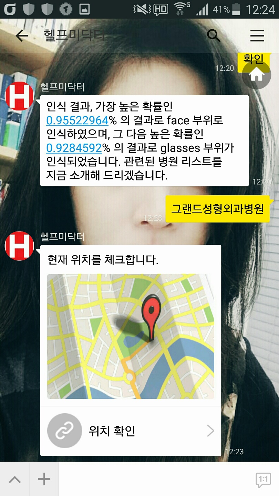
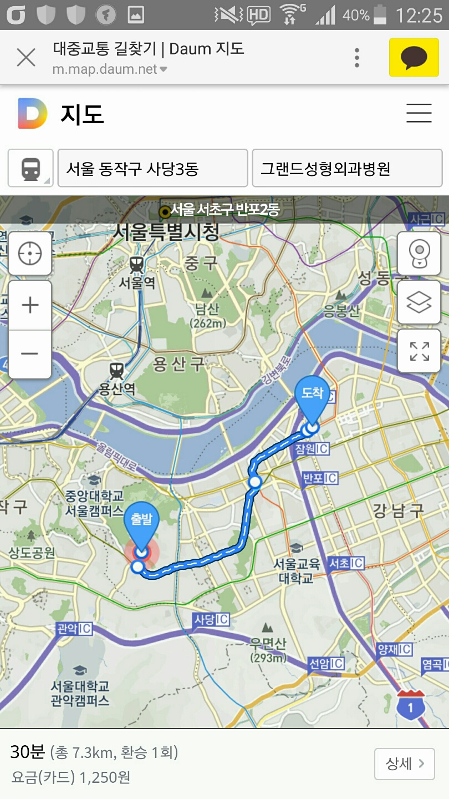
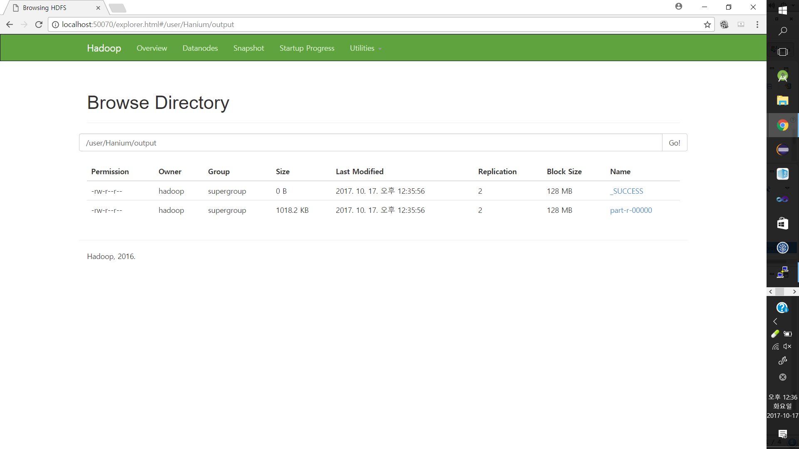
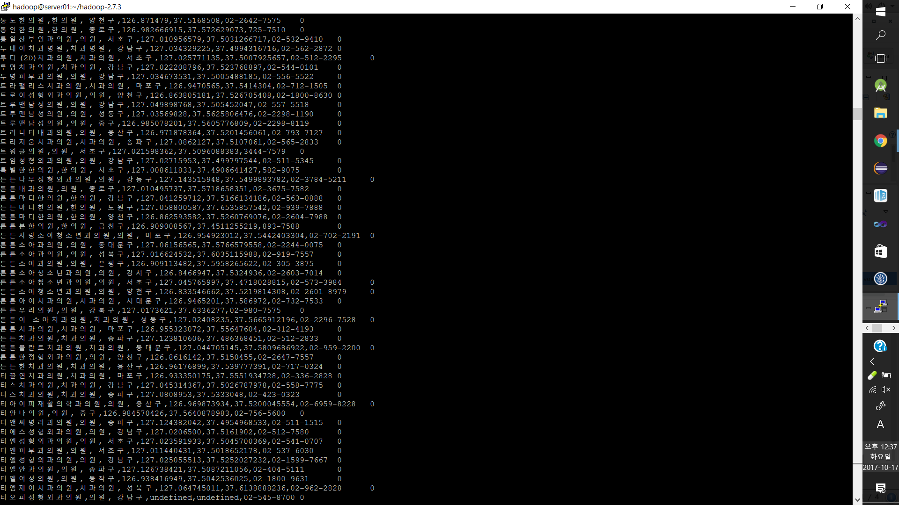
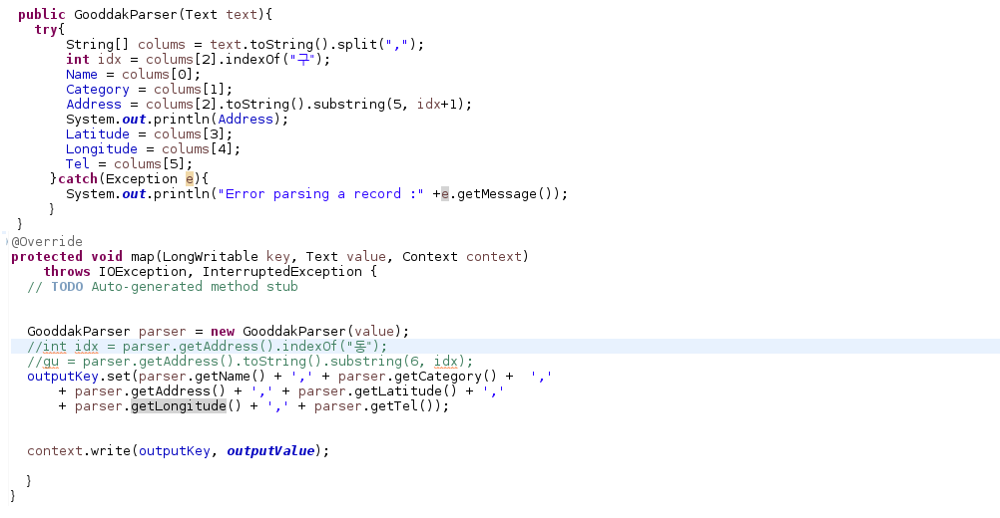
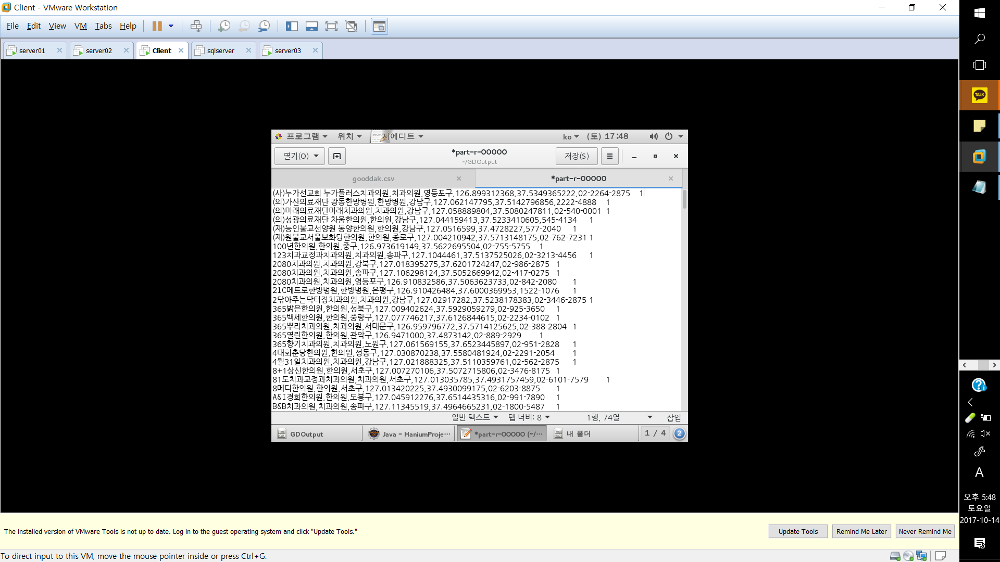
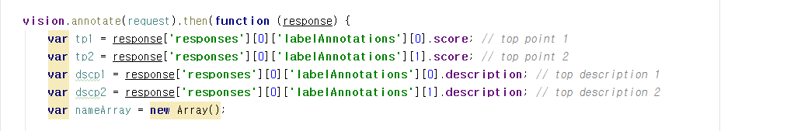

# HelpMeDoctor

---
## 소개 

## 1 . 개발 배경 

### 4차 산업혁명의 도래 & 더 편한 기능을 추구 

    - 급변하는 IT기술에 따라 현 사회도 빠르게 변화하고 있음
    - IoT,AI기술,빅 데이터 등 여러 기술의 도래로 사람들의 삶이 더 편해지고 있음
    - 변화된 SW기술에 빠르게 적응하는 세대가 등장하고 점차 확산되어 누구나 변화되는 IT기술에 뒤처지지 않으려고 노력함
    
### OECD국가 주 노동시간 2위 ..직장인들 자신의 건강 챙길 시간이 부족 

    - 17년 4월 기준 OECD국가에서 노동시간이 많은 나라 2위에 선정
    - 평균 주 53시간 근무 , 직장인들의 피로 원인 1위 : '야근'
    - 바쁜 나날 속에서 자신의 건강을 챙기지 못하여 발생하는 합병증 및 질환

∴ 변화된 IT흐름에 맞게 최신 트렌드인 봇 기술과 빅데이터 그리고 클라우딩 서비스를 기반으로 직장인들에게 

맞는 병원을 손쉽게 알려주고 해당 목적지까지 가는 방법도 제공해주는 병원 매칭 시스템을 기획하게 되었음.

 

## 2 . 프로젝트 핵심 기술 소개 - [*개요 *]

○  4차 혁명의 물결 속에서 AI 기술과 빅 데이터 기술이 각광받고 있음 

○  현대인들은 현존하는 SW기술에도 익숙하고 현재 서비스 되고 있는 여러   IT 기술에도 빠르게 적응하고 있음

○  변화하는 사회에서 핵심 기술인 

**자동화시스템**, **군집화(클러스터링)**, **빠른 응답속도와 정확한 반환 가치** 등이 대두되고 있음. 

 

## ○ 프로젝트 핵심 기술 소개 - [*기술 *]

### - 클라우드 서비스 (AWS)    

> 1. EC2를 활용한 서버 네트워크 인프라를 의미하며 메시지 알고리즘이 정의 되어 사용자와 채팅 봇 간의 소통을 관리한다.
> 2. 핵심 시스템 플로우를 총괄하며 모든 이벤트들이 발생하고 
관리하는 곳으로, 사용자가 원하는 정보만을 필터링하여 제공해준다. 

---

### - Chat-bot AI기술 & Vision.ai 기술 

> 1. Kakao.api를 활용한 채팅 봇 서비스를 구현하였고 관련 알고리즘을 서버 인프라에 구축하였음.
> 2. 미리 구축된 메시지 알고리즘을 통하여 사용자가 원하는 정보만을 필터하여 제공해준다.
> 3. Vision.ai 기술을 활용하여 사용자가 보내는 이미지가 어떠한 것을 가리키는지 분석하여 원하는 데이터를 적재적소에 제공하도록 한다.
> 4. 두 기술은 사용자들에게 빠른 응답과 사용자 니즈를 충족한 서비스로 학습을 통해 더 나은 서비스로 제공된다.

### - 빅 데이터 기술 활용 

> 1. 병원 공공 데이터 API를 활용하여 Raw 데이터들을 의미 있는 데이터로 정리하고 군집화(Clustering) 작업을 통해 세세하게 구조화 한다. (key-value)
> 2. 사용자의 니즈에 맞게 정보를 분산 처리 하여 원격 SQL서버인 RDS에 데이터를 전송하고 이를 관리한다.
> 3. 관리된 데이터들은 사용자의 니즈에 맞게 추가 가공되어 빠르고 정확하게 제공 된다.

### - vision.ai 활용 사진 인식
> 1. 채팅 봇 요청에 맞게 이미지를 메시지로 전달할 경우 어떤 대상을 나타내는지 부위 인식과 그 인식률을 같이 제공해준다.
> 2. 제공된 부위와 인식률을 가지고 병원 리스트를 뿌려줍니다.
> 3. 가야할 병원을 선택할 경우 현 위치부터 병원(목적지)까지의 경로를 알려줍니다.

## 3. 결과 산출물
### a. 사용자 시나리오 UI

<table border ="1"> 
   <tr border="1">
      <td></td>
      <td></td>
      <td></td>
   </tr>
   <tr border="1">
      <td></td>
      <td></td>
      <td></td>
   </tr>
</table>
----

### b. 기술적 산출물 

<table border ="1"> 
   <tr>
      <td></td>
      <td></td>
      <td></td>
   </tr>
   <tr>
      <td></td>
      <td></td>
   </tr>
</table>

---
#### b. 설명 

(1,1) : hadoop 정리 영상 (HDFS) 모습

(1,2) : hadoop 서버에서 데이터 관리하는 모습

(1,3) : Map-Reduce 및 Sqoop 작업 소스코드

(2,1) : 분산 처리 후 필요 데이터만 정제한 모습(SQL)

(2,2) : Vision.ai 에서 핵심 코드  

 

## 4. 시연 영상 

## 5. 소스코드 설명

### <a href="./explain/kakao.md"> " 카카오 API 활용 방법 & 채팅 알고리즘 설명 " </a> 

--- 

(추가 설명 진행 중..)
