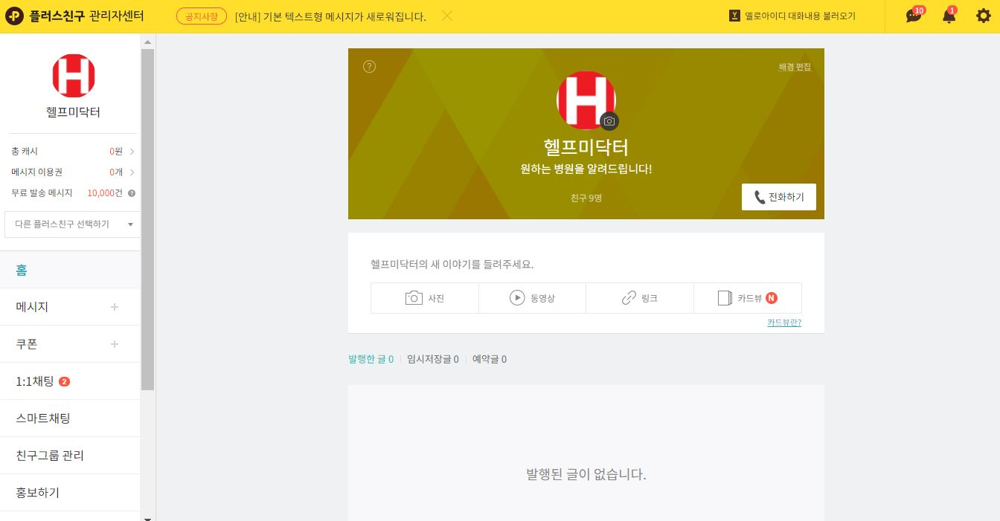
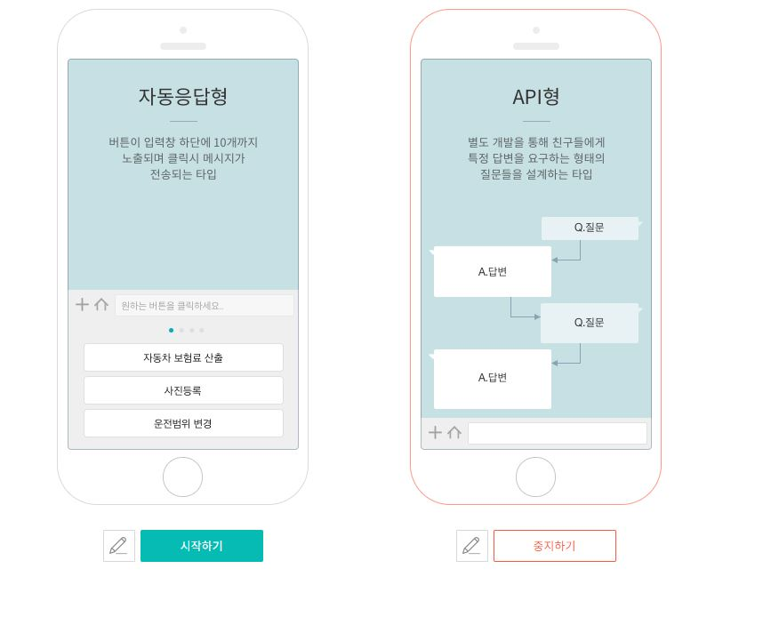
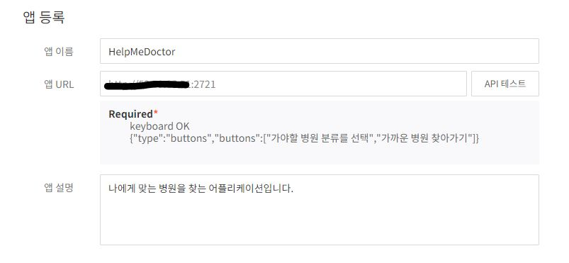
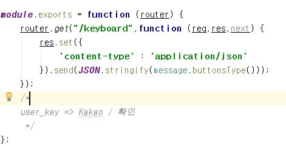

# 카카오 톡 채팅 봇 활용하기 
---

## 1. 활용 방법 과정 
<table border ="1"> 
   <tr>
	  <td>
        
	  </td>
   </tr>
   <tr>
	  <td>
		<a href="https://yellowid.kakao.com/bot#"> 카카오 플러스 친구 등록 </a>
	  </td>
   </tr>
</table>

### 1 . 카카오 플러스 친구를 만든다. 소요 시간은 요청 이 후 약 일주일 정도의 시간이 걸린다.

### 2 . 플러스 친구를 만들었다면 위와 같은 페이지가 만들어질 것입니다. 여기서 스스로 필요 부분을 장식해주세요. 
(프로필 수정,안내메시지 등등..)
<table border ="1"> 
   <tr>
	  <td>
        
	  </td>
   </tr>
</table>

### 3 . 스마트 채팅 선택 후 본인이 만든 서버 인프라에 URL을 Keyboard 선택의 end-point로 맞춰줍니다.


<table border ="1"> 
   <tr>
	  <td>
        
	  </td>
   </tr>
   <tr>
	  <td>
		
	  </td>
   </tr>
   <tr>
	  <td> 아래 사진은 http://ip주소:포트번호/keyboard로 요청이 올 경우 입니다.

	  이와 마찬가지로 keyboard 요청 오기 전 부분 
      (ip주소:port번호) 까지만을 앱 URL에 등록해주시고 API테스트를 진행하시면 됩니다.
	  </td>
   </tr>
</table>

```

		var message = {};

		message.buttons = ['가야할 병원 분류를 선택', '가까운 병원 찾아가기'];
		message.texts = "가야할 위치를 입력해주세요.";
		message.textType = () => {
    	return {
        	type:"text",
        	text : message.texts
        }
	};

		message.buttonsType = () => {
    		return {
        		type: "buttons",
        		buttons: message.buttons
    		}
		};


		message.baseType = (text) => {
    		return {
        		message: {
            		text: text,
        		},
        		keyboard: {
            		type: 'buttons',
            		buttons: message.buttons
        		}
    		}
		};
	
		message.labelMessage = (text,label,url_button) =>{
    		return {
        		message : {
            		text:text,
            		message_button :{
                		label:label,
                		url:url_button
            		}
        		},
        		keyboard:{
            		type:'buttons',
            		buttons:message.buttons
        		}
    		}
		};

	module.exports = message;

```

메시지 정의 부분 입니다. 위에서 JSON형태로 메시지를 보내는데 버튼 타입으로 보내게 됩니다. 

이는 아래 코드인 message.js에 정의된 내용으로
이를 가지고 와서 버튼 형태로 뿌려주겠다는 뜻입니다.


### 4 . 본 내용은 kakao.api를 활용하고자 사전 작업으로 keyboard의 endpoint에 요청이 오는 지를 확인한 것입니다.

### 5 . 제대로 된 서비스는 /message endpoint로 요청이 들어올 경우 시작합니다.

```

		var checkUserKey = (req, res, next) => {
        if (req.body.user_key != undefined) {
            console.log(req.body.user_key);
            next();
        } else {
            console.log("user key is not exist");
            res.status(500).send({error: 'user_key is invalid'});
        }
    };


```

: 사용자 유저키를 먼저 체크합니다. 이를 미들웨어 형태로 함수를 만들어 제공합니다. 


```

	router.post("/message", checkUserKey, query_func, function (req, res) {
        const _obj = {
            user_key: req.body.user_key,
            type: req.body.type,
            content: req.body.content
        };

        console.log(_obj.content);
        if (_obj.content == "가야할 병원 분류를 선택") {
            console.log("첫 번째 버튼 클릭");
            index = 1;
            hurt_part_check();
        }
        else if (_obj.content == "가까운 병원 찾아가기") {
            index = 0;
            console.log("두 번째 버튼 클릭");
            setLocation1();
            //hos_close_here();
        }

    ...
	...

```

/message endpoint로 요청이 post방식으로 들어올 경우 이는 사용자의 메시지 요청을 봇에 전달하는 부분입니다.

여기서 정의된 _obj.content 부분이 사용자 메시지 전달 부분입니다.

전달한 메시지에 따라 메시지 알고리즘을 구현해야 하는데 핵심 포인트는 사용자가 메시지를 보낼 때 

/message endpoint로 제공되는 것이기 때문에 
_obj.content를 지속적으로 관리하면서 메시지 알고리즘을 정리해야 합니다.

마치 재귀 함수와 같은 느낌이라고 생각하시면 됩니다.


### 6 . 예시

1 . _obj.content == "가야할 병원 분류를 선택" 

2 . hurt_part_check() 함수로 이동
```

		function hurt_part_check() {
        message = {
            "message": {
                "text": "가야할 병원을 선택해주세요."
            },
            "keyboard": {
                "type": "buttons",
                "buttons": [
                    /*
                     병원 분류해서 15개로 추려서 정리할 것
                     */
                    "사진으로 아픈 부위 알리기",
                    "아픈 부위 선택 하기"
                ]
            }
        };


```

3 . 위 함수에서 메시지가 정의되어 있고 정의된 메시지는 사용자에게 버튼 형태로 제공된다.
(keyboard 부분이 사용자에게 제공되는 메시지입니다.)

4 . 이 후에 사용자는 그 버튼 메시지를 선택할 경우 다시 /message endpoint로 요청이 온다.

제공된 메시지는 위 endpoint에서 _obj.content로 다시 회귀한다. 

이를 활용하여 알고리즘을 구현하면 된다.